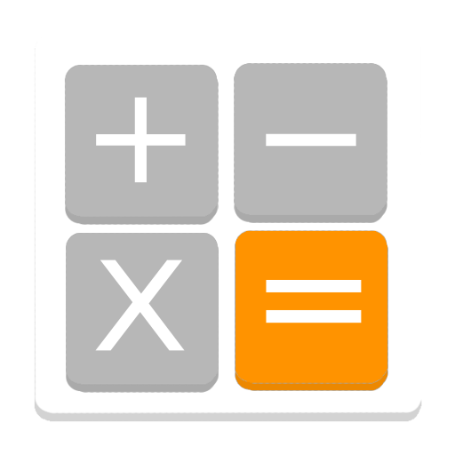
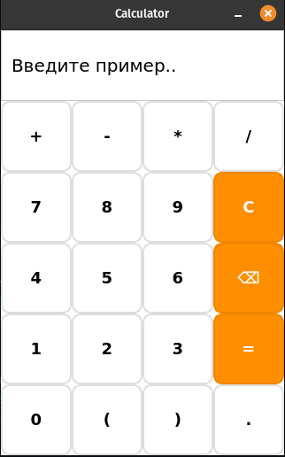

# Калькулятор на Python с PyQt5

Простой, но функциональный графический калькулятор с поддержкой основных математических операций.

## 📋 Функционал
- Базовые операции: +, -, *, /
- Поддержка скобок: ( )
- Работа с десятичными числами
- Удаление последнего символа (Backspace)
- Очистка всего выражения (Clear)
- Подсчет результата (=)
- Прокручиваемое поле ввода для длинных выражений
- Адаптивный интерфейс (фиксированный размер окна)

## 🛠️ Технологии
- Python 3.10+
- PyQt5
- Система сборки: стандартный Python (без зависимостей кроме PyQt5)

## ⚙️ Установка
Убедитесь, что у вас установлен Python 3.10 или новее
```bash
pip install PyQt5
git clone https://github.com/keymorks/python-mini-projects.git
cd python-mini-projects && cd calculator
python3 . -m
```

## 📸 Скриншоты


